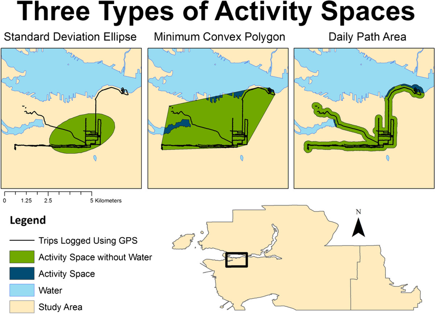
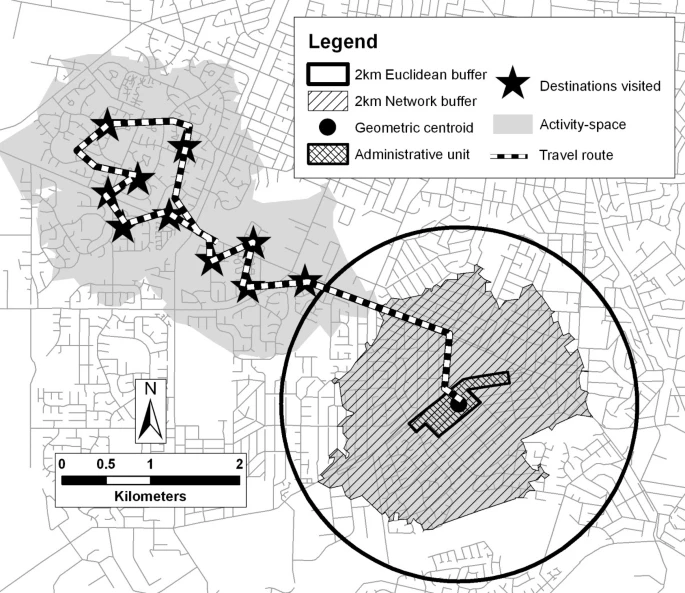
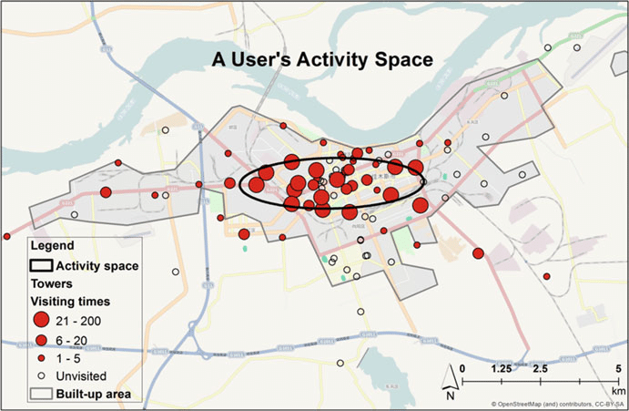

Project Proposal Template
================
Kaitlyn Biehler

[<i class="fa fa-file-code-o fa-1x" aria-hidden="true"></i> Download
this file as a
template](http://adamwilson.us/SpatialDataScience/scripts/Project_ProposalTemplate.Rmd).

# Introduction to problem/question

Affect, or emotion, is a critical determinant of drinking risk and
drinking behavior. According to reinforcement models, people turn to
drinking to reduce negative affect and/or increase positive affect.
These models describe a dynamic process, whereby affect is linked to
drinking in real time. Understanding the factors that influence
affect-related drinking as it occurs dynamically, in daily life, can
elucidate risk processes and guide intervention. How people respond to
NA in daily life depends at least in part on the environmental context
in which that affect occurs. Alcohol cues are an important component of
this context. These cues occur through exposure to locations, such as
alcohol outlets (e.g., bars, liquor stores) or places personally
associated with drinking (e.g., favorite drinking locations).

# Problem / Question

We don’t yet understand the effect of environmental alcohol cue contexts
on negative affect driven drinking. This project is about mapping these
alcohol cues along with a person’s movement over time.

# Inspiring Examples

Include links and screenshots (or embedded images) of a few (\~3-5)
example graphics found on the internet that convey what you want to do.
Include a few sentences about why you selected each link.

## Example 1

This graphic shows an example of the types of activity spaces that can
be created. We may use some or all of these types of spaces to represent
a person’s activity space during the study.

## Example 2

 This graphic does a nice job
showing both the path of a person’s space as well as locations they
visited. I also like how they have multiple different areas to indicate
different environments. \## Example 3

This graphic shows a user’s activity space that also represents the
number of times a place was visited. I hope to represent something
similar with some of the data for this project.

# Proposed data sources

One source of data will be the alcohol outlet location information
updated daily by the State Liquor Authority at this webpage:

The other source will be data collected from participants in a study.
This data may be in part generated to maintain confidentiality. Because
the data contain’s individual location information it will not be made
publicly available.

# Proposed methods

I will need to use packages to download the publicly available data and
manipulate it so that is is a spatial data object. I will need to join
that dataset with the study data and map them both together.

# Expected results

I want to be able to produce graphics that include both the alcohol
outlet location information as well as the person’s location information
in a single map.
