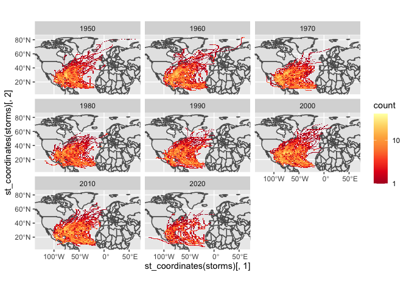
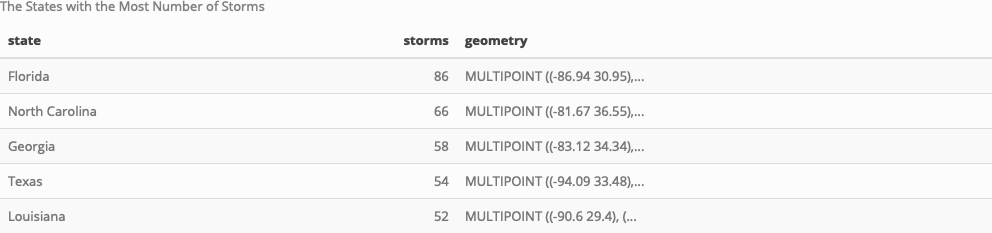

Case Study 09
================
Kaitlyn Biehler
November 1, 2022

# Install libraries and dependencies

``` r
library(sf)
```

    ## Linking to GEOS 3.10.2, GDAL 3.4.2, PROJ 8.2.1; sf_use_s2() is TRUE

``` r
library(tidyverse)
```

    ## ── Attaching packages
    ## ───────────────────────────────────────
    ## tidyverse 1.3.2 ──

    ## ✔ ggplot2 3.3.6      ✔ purrr   0.3.4 
    ## ✔ tibble  3.1.8      ✔ dplyr   1.0.10
    ## ✔ tidyr   1.2.1      ✔ stringr 1.4.1 
    ## ✔ readr   2.1.2      ✔ forcats 0.5.2 
    ## ── Conflicts ────────────────────────────────────────── tidyverse_conflicts() ──
    ## ✖ dplyr::filter() masks stats::filter()
    ## ✖ dplyr::lag()    masks stats::lag()

``` r
library(ggmap)
```

    ## Google's Terms of Service: https://cloud.google.com/maps-platform/terms/.
    ## Please cite ggmap if you use it! See citation("ggmap") for details.

``` r
library(rnoaa)
```

    ## Registered S3 method overwritten by 'hoardr':
    ##   method           from
    ##   print.cache_info httr

``` r
library(spData)
library(kableExtra)
```

    ## 
    ## Attaching package: 'kableExtra'
    ## 
    ## The following object is masked from 'package:dplyr':
    ## 
    ##     group_rows

``` r
library(magick)
```

    ## Linking to ImageMagick 6.9.12.3
    ## Enabled features: cairo, fontconfig, freetype, heic, lcms, pango, raw, rsvg, webp
    ## Disabled features: fftw, ghostscript, x11

``` r
library(dplyr)
data(world)
data(us_states)

# Download zipped data from noaa with storm track information
dataurl="https://www.ncei.noaa.gov/data/international-best-track-archive-for-climate-stewardship-ibtracs/v04r00/access/shapefile/IBTrACS.NA.list.v04r00.points.zip"

tdir=tempdir()
download.file(dataurl,destfile=file.path(tdir,"temp.zip"))
unzip(file.path(tdir,"temp.zip"),exdir = tdir) #unzip the compressed folder
storm_data <- read_sf(list.files(tdir,pattern=".shp",full.names = T))
```

\#Wrangle the data

``` r
storms <- storm_data %>%
  dplyr::filter(year >= 1950) %>%
  mutate_if(is.numeric, function(x) ifelse(x==-999.0,NA,x)) %>%
  mutate(decade=(floor(year/10)*10))
```

\#Identify the bounding box

``` r
region <- st_bbox(storms)
```

\#Make the first plot

``` r
ggplot(world)+
  geom_sf()+
  facet_wrap(~decade) +
  stat_bin2d(data=storms, 
             aes(y=st_coordinates(storms)[,2],
                 x=st_coordinates(storms)[,1]),bins=100) +
  scale_fill_distiller(palette="YlOrRd", 
                       trans="log", direction=-1, 
                       breaks = c(1,10,100,1000)) +
  coord_sf(ylim=region[c(2,4)], xlim=region[c(1,3)])
```

<!-- -->
\#Calculate a table with the five states that have the most storms

``` r
#Reproject the crs of us_states
states <- st_transform(us_states, crs = st_crs(storms)) %>%
  select(state = NAME) #rename NAME to state
#join the datasets
  storm_states <- st_join(storms, states, join = st_intersects,left = F)
#group and rearrange
  top5 <- storm_states %>%
    group_by(state) %>%
    summarize(storms=length(unique(NAME))) %>%
    arrange(desc(storms)) %>%
    slice(1:5)
  top5
```

    ## Simple feature collection with 5 features and 2 fields
    ## Geometry type: MULTIPOINT
    ## Dimension:     XY
    ## Bounding box:  xmin: -106.4 ymin: 24.6 xmax: -75.9 ymax: 36.55
    ## Geodetic CRS:  WGS 84
    ## # A tibble: 5 × 3
    ##   state          storms                                                 geometry
    ##   <chr>           <int>                                         <MULTIPOINT [°]>
    ## 1 Florida            86 ((-86.94 30.95), (-87.21 30.92), (-87.44 30.89), (-87.5…
    ## 2 North Carolina     66 ((-81.67 36.55), (-81.99 36), (-82 35.8), (-81.7 35.9),…
    ## 3 Georgia            58 ((-83.12 34.34), (-83.5 34.5), (-83.28 34.65), (-84.21 …
    ## 4 Texas              54 ((-94.09 33.48), (-94.9 33.5), (-94.56 33.36), (-94.5 3…
    ## 5 Louisiana          52 ((-90.6 29.4), (-90.5 29.4), (-90.3 29.3), (-90.29 29.2…

# Create a nicer table

``` r
top5 %>%
  kbl(caption = "The States with the Most Number of Storms") %>% 
    kable_styling(bootstrap_options = c("striped", "hover"), full_width = T, position = "left") %>%
    as_image(width = 10,file = "stormstable.png")
```

<!-- -->
